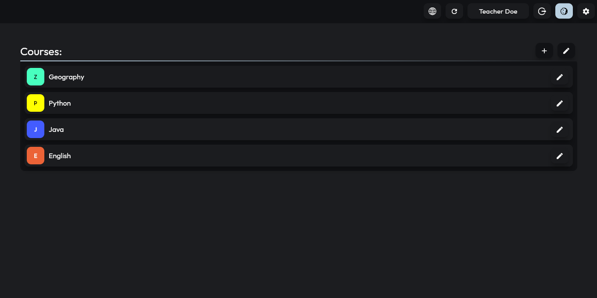
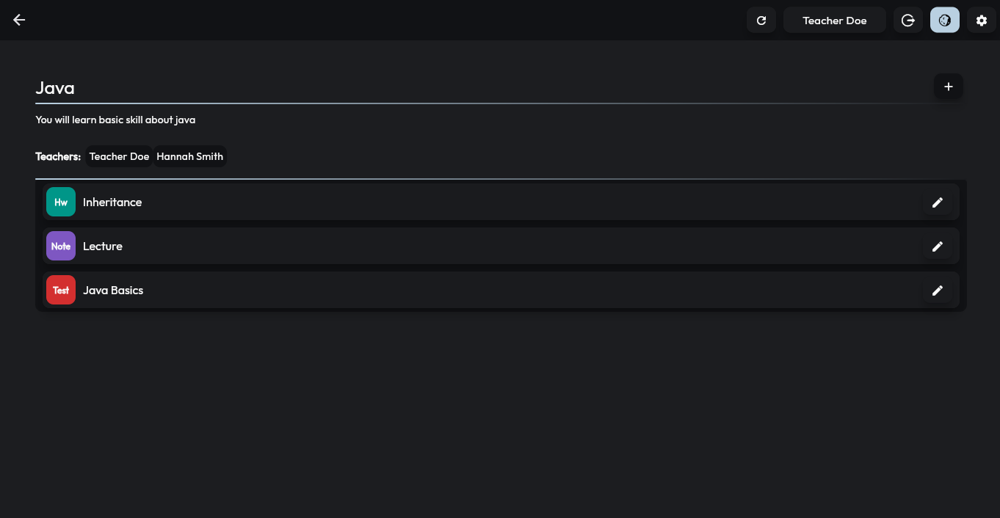

<p align="center">
  
</p>

<h3 align="center">Online E-Learning System</h3>

<p align="center">
  Made for make learning more fun
  <br>
  <a href="https://github.com/sobotat/OES/discussions/categories/ideas">Request feature</a>  
  ·
  <a href="https://github.com/sobotat/OES/issues">Report bug</a>
  ·
  <a href="https://github.com/sobotat/OES/discussions/categories/q-a">Questions</a>
  · 
  <a href="https://github.com/sobotat">Author</a>
</p>

---
### <span style="color:#96c8ff">Info</span>

The app is designed to make learning more fun. 
The app is made like a Bachelor's thesis.

---
### <span style="color:#96c8ff">UI</span>




---
### <span style="color:#96c8ff">How To Use</span>

1. Download Docker
2. ``` docker pull sobotat/oes-web ``` 
3. ``` docker run -d --restart unless-stopped -p 80:80 sobotat/oes-web ```

---
### <span style="color:#96c8ff">Ideas or Bugs</span>

It's like with any software. I'll be glad for any reported bugs, and I'll also be glad for ideas on how to improve the application.

🛠️ You can report a bug <a href="https://github.com/sobotat/OES/issues">Here</a> <br>
⭐ Here you can tell about your idea <a href="https://github.com/sobotat/OES/discussions/categories/ideas">Here</a>
